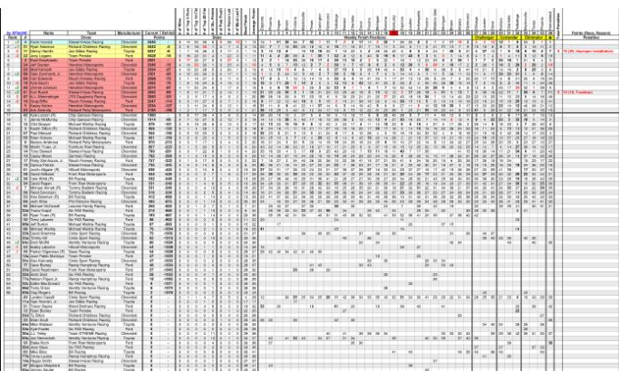
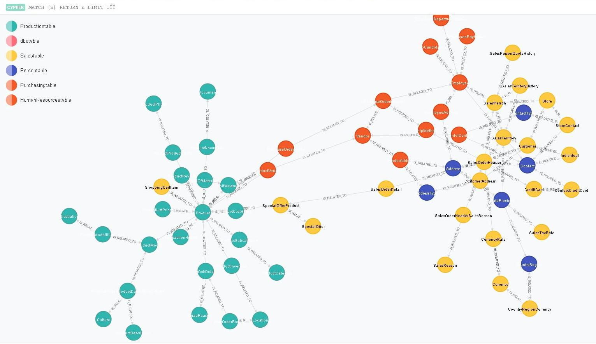
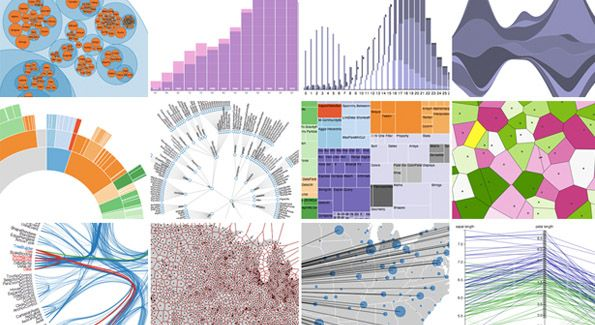

<section data-state="no-title-footer">

 

#  Big Fish
****
#### Created by The Insighters
__*FEBRUARY 2018*__
 
 

<!-- <a href="http://ner.appstore.capinsighters.com"> > Go to app </a> -->

---

# What does it do?
#####  Fraud Detection  in an innovative way

 

	

	  
 **PEOPLE:**  Felix Revert, Marie-Cecile Riom 
	   

	

	

		
	

	  
 **LOCATIONS:**  Paris, France 

	

	

		
	

	  
 **ORGANIZATIONS:**  Fast Digital Team 

	

---

#####  How to catch a fraud with that ?       

<!-- .element: class="fragment" data-fragment-index="3" -->

---

#####  Isn't it better ?       
<!-- 

 --> <!-- path to the html file with visualization code -->	

<!-- <iframe style="overflow:hidden;margin:5px 5px auto auto;" class="stretch" scrolling="no" id="chart-frame-1" data-chart></iframe>	 -->

<!--  -->
<!-- .element: class="fragment" data-fragment-index="2" -->

---

# Get business value
##### A few selection of  use-cases  
  

 
	
	 __Sector:__ Financial Services       
	 __Use-case:__     
	   __Fraud detection on loan funding__   
	   *How to detect fraud in a digital factoring platform ?  
	Combaining a graph vizualisation and ML algorithm to detect suspicious relation between clients and unsual behaviour*  

 <!-- .element: class="fragment" data-fragment-index="1" -->

	
	 __Sector:__ Unemployment Office       
	 __Use-case:__    
	   __Fraud detection within job seeker__   
	   *Detection of fraudulent application for a job  
	Combaining a graph vizualisation and ML algorithm to detect unusal relation between Job seeker and abnormal use* 

 <!-- .element: class="fragment" data-fragment-index="2" -->

---

# Why use this tool?
##### 3  key differentiatiors 

 

###### Vizualiaze your data base in an  
######  interactive graph    

     

###### Find  communities, motif and special 
###### relations   in your data  

     	

###### Cross your graph visualization with 
###### quantitative data to better identify 
###### and qualify  your nodes  

     

---

#The technology behind
##### What happens  behind the curtain?    

 

__Combining  statistical  state-of-the-art methods...  __

___

Graphe Modeling  
ML tools for scoring and classification 

 <!-- .element: class="fragment" data-fragment-index="2" -->

 

 

__... with vizualisation  tools   __

___

Noe4j  
D3.js  

 <!-- .element: class="fragment" data-fragment-index="3" -->

 

 

__... and cutting-edge  technology   __

___

Available on Docker, Packaged tool on shelf  
Easily portable anywhere, Easily integrable to legacy  

 <!-- .element: class="fragment" data-fragment-index="4" -->

---

#What's next?
##### Your demonstrator's  roadmap    

 

 
	

__January 2018:__ *Design Phase*
__March 2018:__ *First Version*  
__May 2018:__ *Second Version*
__Avril 2018:__ *Industrialization*
__June 2018:__ *Release*

	

 

---
 
** Next step **

- We are looking for a UX designer

- How about colaborating with a Startup that worked on a User Friendly Graph Interface as Likurious ? 

 
 
 

###### <a href="http://appstore.capinsighters.com/"> Back to appstore </a>
